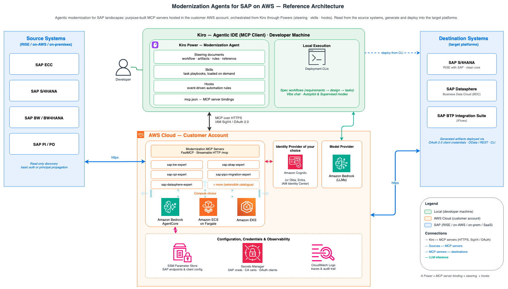

# Modernization Agents for SAP on AWS

## Overview

Kiro is AWS's AI-powered engineering agent, designed for enterprises to build production-ready software. With Kiro, customers can build across large codebases with parallel agents, which is ideal for complex, resource-intensive projects like SAP modernizations. This repository provides Kiro-based sample agents that customers and partners can use to accelerate the modernization and deployment of custom SAP Advanced Business Application Programming (SAP ABAP) programs, SAP Business Warehouse (SAP BW), and SAP Process Integration and SAP Process Orchestration (SAP PI / PO) on AWS. These agents bring together model choice, a Model Context Protocol (MCP) server, and Kiro Powers. Kiro Powers include steering documents for repeatable workflows, modernization best practices, and safety hooks that guide each workload from analysis to converted, cloud-native target objects.

SAP is where many organizations house their most critical business logic and data. Custom SAP ABAP programs drive core processes like finance, order management, and supply chain operations. SAP BW underpins the reporting and analytics that enterprises rely on for planning and decision-making. SAP PI / PO serve as the middleware connecting SAP to hundreds of external systems, trading partners, and applications. Modernizing these workloads manually is what makes SAP transformations so time and resource intensive. Additionally, with the end of standard support for SAP BW, SAP PI / PO, and on-premises SAP ERP Central Component (SAP ECC) approaching, customers need to modernize to SAP's cloud-native systems.

With these sample agents, customers can accelerate their SAP modernizations, which are historically one of the most resource-intensive undertakings in enterprise IT. With a single prompt, the sample agents can mass-modernize thousands of lines of SAP ABAP code, migrate hundreds of end-of-support SAP PI/PO interfaces to SAP BTP Integration Suite, and move SAP Business Warehouse (BW) data models to SAP Datasphere in Business Data Cloud (BDC) in hours, not months.

**Supported use cases:**

- **Make ABAP S/4HANA compliant:** convert ABAP code from your SAP ECC system into S/4HANA-compliant code in bulk.
- **Refactor ABAP to clean core:** automate refactoring of custom ABAP to align with SAP's Clean Core extensibility model and standard APIs.
- **Modernize SAP PI/PO to SAP BTP:** convert PI/PO interfaces to BTP Integration Suite ahead of PI/PO end of standard support.
- **Modernize SAP BW to SAP Datasphere / BDC:** move from BW to SAP Datasphere in Business Data Cloud in hours, not months.
- **Generate functional and technical specifications:** analyze existing code and configuration to produce business requirements and technical specs, and keep them current.
- **Automate unit testing:** generate and run unit tests before and after conversion to validate business logic and reduce AI hallucination.

## High-level architecture

## Deployment patterns

Pick a deployment option and follow the guide for the authentication model you need:

| Option | Basic auth | Principal propagation |
| --- | --- | --- |
| Local (Python) | Supported | Not supported |
| Amazon ECS Fargate | Supported | Supported |
| Bedrock AgentCore Runtime | Supported | Supported |
| Amazon EKS | Supported | Supported |

Basic auth uses one shared SAP service user, sufficient for most cases since the source side is typically read-only. Principal propagation carries each caller's own SAP identity and is worth the extra setup where SSO is already in place or policy requires per-caller identity in SAP audit records. A local Python run takes minutes once prerequisites are met; the ECS deployment involves VPC networking, a load balancer, and a CloudFormation stack, so plan on an hour or two for a first run.

## FAQs

## 1. What are AWS Modernization Agents for SAP?

AWS Modernization Agents for SAP are a suite of purpose-built AI agents that assist customers throughout the SAP Activate Methodology lifecycle — from discovery and preparation through to deployment and operations, accelerating key SAP transformation workloads such as custom code analysis, interface migration, and BW modernization.

## 2. What agents are available?

**ABAP** **Modernization Agent—** AI-powered custom code analysis, remediation, and S/4HANA upgrade readiness.

**PI/PO Modernization Agents**— Automated analysis, documentation, and migration of SAP PI/PO interfaces to SAP BTP Integration Suite using functional specification documents.

**BW to Datasphere Modernization Agents** — Modernization of BW Objects to SAP Datasphere.

## 3. How do I get access?

Access is provided through a registration page. Once registered, you will receive access to the GitHub repository containing the agents, deployment guides, and documentation. The registration process enables AWS to share updates, new features, and best practices with adopters.

## 4. How will these agents be delivered to customers and partners?

AWS Modernization Agents for SAP are delivered as AWS CloudFormation templates, enabling automated and repeatable deployment into your AWS environment. This is the same proven delivery mechanism used for other AWS for SAP offerings. The CloudFormation template provisions all required resources — compute, networking, IAM roles, and agent configuration — so you can get started quickly with a consistent, well-architected setup.

## 5. What are the deployment options?

AWS Modernization Agents for SAP can be deployed on:

**Local deployment** — For development, testing, and POC scenarios

**Central** **hosted** **deployment -** Deployment options include Amazon ECS, Amazon EKS and Amazon Bedrock Agentcore.

Detailed deployment guides and documentation are provided for each option.

## 6. Which SAP environments do AWS Modernization Agents for SAP connect to?

AWS Modernization Agents for SAP are intended to connect to non-production SAP environments such as development, sandbox, or QA systems. These agents perform code analysis, conversion, interface conversion, and more - activities that align with the discover, prepare and explore phases of SAP Activate methodology. Converted code and artifacts are then transported to SAP production system through transport and change management processes, ensuring full governance and control.

## 7. What are the pre-requisites for deploying these agents?

Each agent Github repository outlines detailed pre-requisites. Following are general pre-requisites:

1. A supported **SAP NetWeaver version** (refer to each agent's documentation for the exact version required)
2. AWS account and AWS CLI
3. Kiro or supported Agentic IDE
4. Docker,finch or podman to generate container image to be deployed in AWS Cloud
5. Network path between AWS account and SAP systems

## 8. How much do these agents cost?

There is no cost for the agents themselves. Customers and partners can register, download, deploy, and use them free of charge. Standard AWS infrastructure costs apply for the underlying compute and AI services.

## 9. Which IDEs can the AWS Modernization Agents for SAP be used with?

We are distributing the agent sample code designed primarily for Kiro, an AI-powered agentic IDE by AWS. These sample agents are delivered with steering documents to produce deterministic outputs, as part of Kiro Powers that automatically load the right tools and workflows for each SAP workload. These agents are consumed through Kiro using natural-language prompts. Because the agents are built on an open, standards-based integration approach, they aren't locked to a single IDE. Customers can port the steering files and connection setup to work with other agentic IDEs. We will ship new features to Kiro first.

## 10. What security measures are in place?

AWS Modernization Agents for SAP are provided as open-source code, and it is the customer's responsibility to review, test, and validate the agents within their own environment. AWS performs comprehensive security reviews before publishing, including security scans and threat modeling.

## 11. Is there a support model?

AWS has officially published the Modernization Agents for SAP as an open-source, unsupported solution. All customers are responsible for testing and securing the code in accordance with their business security standards and policies before deploying in production.  Customers are free to customize and extend the agents based on their specific requirements.

If a customer requires a formal support arrangement, we can provide options through AWS Professional Services or several of our AWS partners.

As these agents are strategic to our AWS for SAP business, we do intend to continue investing in improving and maintaining the agents.

## 12. How do I report bugs or submit requests for new features?

Customers can report bugs through the GitHub repository

## 13. Will these agents be updated regularly?

AWS will continue to invest in accelerating customer SAP migrations. The Modernization Agents for SAP on AWS provide valuable capabilities to our customers, and we intend to regularly improve and update these agents. As an open-source offering, these agents are provided as-is, without formal commitments around specific updates, bug fixes, or security patches.

Updates will be published via the GitHub repository, and customers can pull the latest versions at their convenience. For customers seeking additional support, options are available through AWS Professional Services or AWS partners.

## 14. Is there detailed documentation and deployment guide?

Yes. AWS provides comprehensive documentation including:

Architecture overviews

Step-by-step deployment guides for each supported deployment option

CloudFormation template reference and configuration instructions

IAM policy templates and security guidance

Best practices and usage examples

Documentation link: *[Link to be included at launch]*

## 15. What SAP systems and versions are compatible?

| SAP Product | Supported Versions |
| --- | --- |
| SAP S/4HANA (on-premise & RISE with SAP) | 1809 and above |
| SAP ECC | EHP 6, EHP 7, EHP 8 (SAP NetWeaver 7.4+) |
| SAP BW/4HANA | 1.0, 2.0 |
| SAP BW | 7.4 SP9, check perquisites guide for lower versions |
| SAP Process Orchestration (PO) | 7.31, 7.4, 7.5 |
| SAP Process Integration (PI) | 7.1, 7.31, 7.4, 7.5 |
| SAP BTP Integration Suite |  |
| SAP Business Data Cloud (BDC) |  |

## 16. Are there any restriction on choice for LLM's for using these agents?

AWS Modernization Agents for SAP are optimized for and tested with Anthropic Claude models available through Amazon Bedrock. Claude is the recommended and supported LLM for these agents, and is used for complex SAP code analysis, interface migration, and documentation tasks. While the open-source nature of the agents allows for customization, AWS recommends using the tested Claude model configurations for optimal results.

---

# Partner FAQs

## 1. How can partners get involved with AWS Modernization Agents for SAP?

Partners follow the same registration-based access model as customers. Register via the AWS registration page to gain access to the GitHub repository containing the agents, deployment guides, and documentation. Partners are encouraged to run POCs on customer environments to build delivery capability and references early.

## 2. Can partners customize, extend, or build their own solutions on top of AWS Modernization Agents for SAP?

Yes.  The agents are published as open-source, which means partners are free to customize and extend them based on customer-specific requirements. This includes adapting agent logic, adding customer-specific rules, or integrating with additional tools and workflows. Partners can embed these agents into their delivery frameworks, package them as managed services, or list differentiated offerings on AWS Marketplace to reach a broader customer base.

While not a requirement given the open-source nature of these agents, we encourage partners to publicly acknowledge the use of AWS Modernization Agents for SAP in their go-to-market offerings.

## 3. What skills does a partner team need to deliver with these agents?

Partner delivery teams should be familiar with:

SAP ABAP, PI/PO, BW, or BTP Integration Suite (depending on the agent)

Kiro IDE/CLI — the primary development environment for developing and running agents

Amazon Bedrock and AgentCore — the AWS AI services that power the agents

AWS CloudFormation — for deploying agents into AWS accounts.

*For additional questions, please contact your AWS account team or visit aws.amazon.com/sap.*

## Getting started

To get started, register for access to the sample code and deployment guides through the AWS registration page: [Modernization Agents for SAP on AWS, registration](https://pages.awscloud.com/Q4GLBLSAPAgentsforERP_01-Core-RegFormLP.html)
